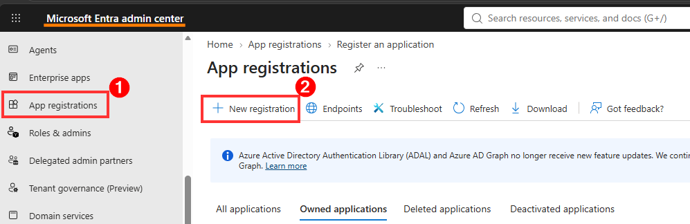
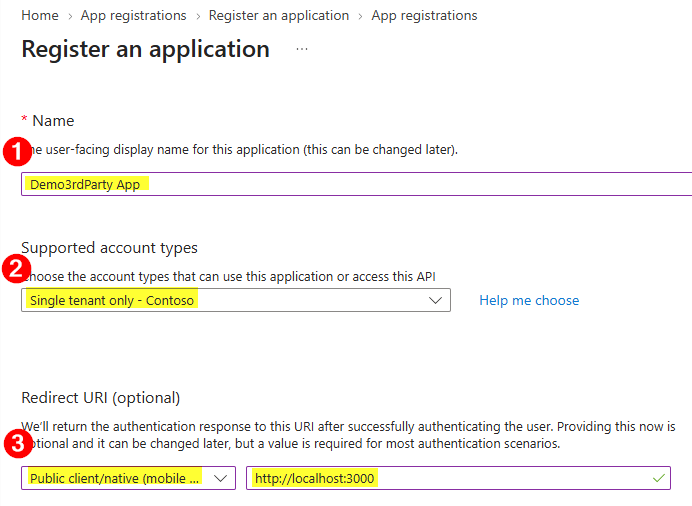
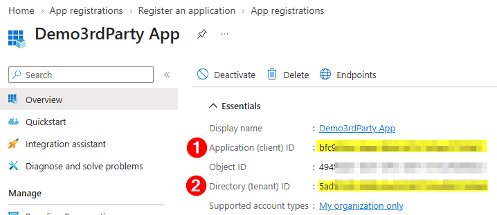
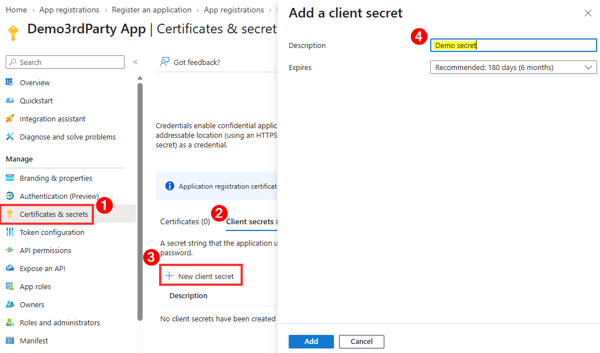
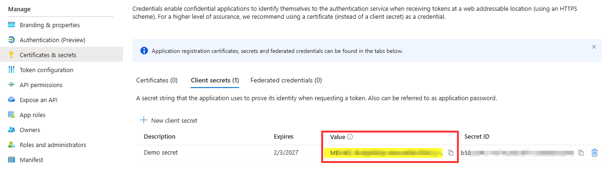
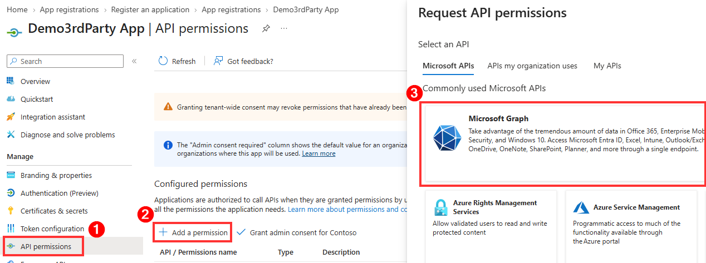
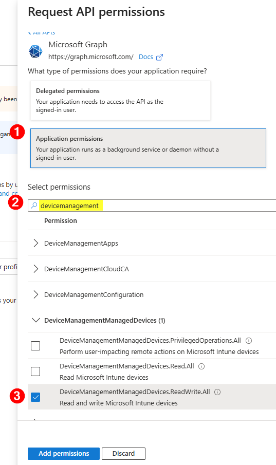
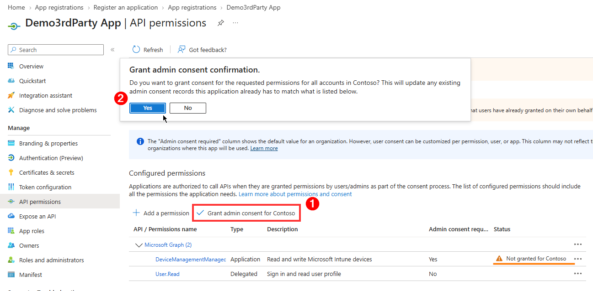

# How to Set Up an App Registration

This guide mirrors the setup walkthrough from the app and can be shared directly from the repository.

## Overview

Create a Microsoft Entra app registration for client-credential authentication, then grant Microsoft Graph application permissions.

## Step 1: Register a new app

1. Open the Microsoft Entra admin center.
2. Go to App registrations.
3. Select New registration.

## Step 2: Complete the registration form

1. Enter an app Name.
2. Choose the Supported account types.
3. Set the Redirect URI.
4. Select Register.

Use the same values shown in the setup screenshots.

## Step 3: Copy the application identifiers

From the app Overview page, copy and save:

- Application (client) ID
- Directory (tenant) ID

You will use both values in the simulator.

## Step 4: Create a client secret

1. Open Certificates and secrets.
2. Select Client secrets.
3. Select New client secret.
4. Enter a description and expiration.
5. Select Add.

## Step 5: Copy and protect the secret value

Copy the secret Value immediately and store it securely. The full value is only shown once.

## Step 6: Add Microsoft Graph permissions

1. Open API permissions.
2. Select Add a permission.
3. Choose Microsoft Graph.

## Step 7: Select application permissions

1. Select Application permissions.
2. Search for DeviceManagementManagedDevices permissions.
3. Select DeviceManagementManagedDevices.ReadWrite.All.
4. Select Add permissions.

ReadWrite.All is required for POST operations.

## Step 8: Grant admin consent

1. Select Grant admin consent for your tenant.
2. Confirm the prompt.
3. Verify permission type is Application.
4. Verify status shows Granted.

## Setup complete

After finishing these steps, open the simulator and enter:

- Tenant ID
- Client ID
- Client Secret

Then acquire a token and run Graph requests.
