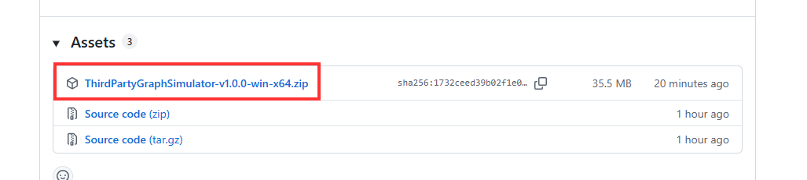
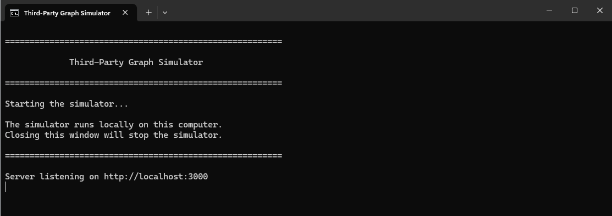
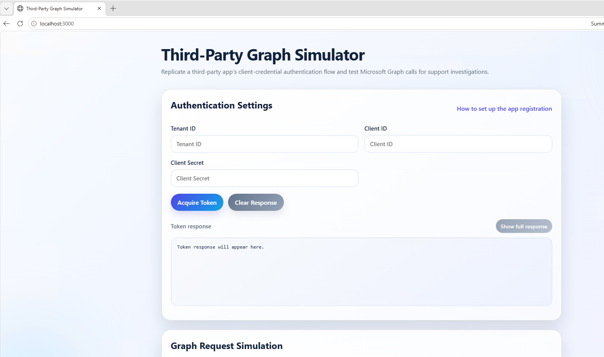
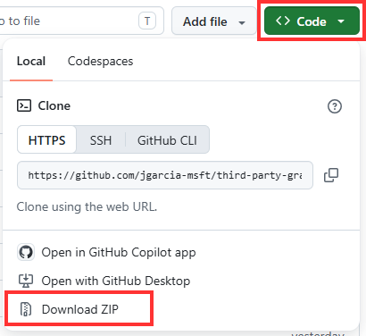
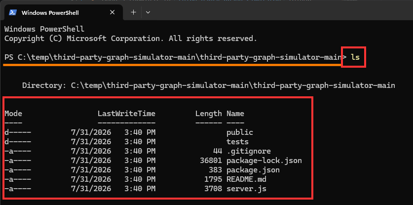
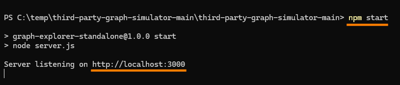
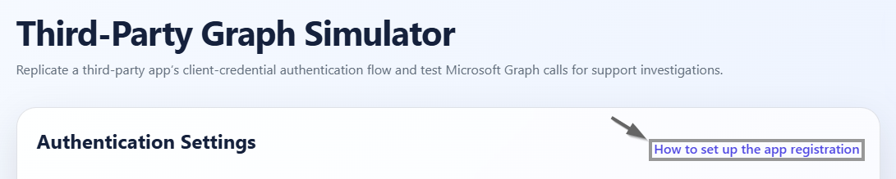

# Third-Party Graph Simulator

> [!WARNING]
> ***This is for internal testing only. Not for production. DO NOT ENTER CUSTOMER DATA***

A lightweight standalone website for testing a third-party app’s client-credential authentication flow and test Microsoft Graph calls for support investigations.

## Features
- Enter Tenant ID, Client ID, and Client Secret
- Acquire an app-only access token from Entra ID
- Send Graph API requests through a backend proxy
- Reuse cached tokens until expiration

## Prerequisites

- **Node.js:** Install Node.js (LTS recommended, e.g. Node 18 or later) which includes `npm`. See [How to install Node on Windows](https://learn.microsoft.com/en-us/windows/dev-environment/javascript/nodejs-on-windows) or Recommended [Download and use Node installer](https://nodejs.org/en/download). **Only needed if you follow the manual setup. Recommend using the Quick Start**
- **Entra ID app registration:** Create an app registration in the Azure portal and configure it for client credentials (app-only) flow:
	- Note the **Tenant ID**, **Application (client) ID**, and create a **Client secret**.
	- Grant the app the necessary **Application permissions** for Microsoft Graph (for example, `User.Read.All`, `Group.Read.All`, etc.) depending on the Graph endpoints you will call.
	- Click **Grant admin consent** for the permissions you added.

**Note: After you setup and run the app there is a link for step by step instructions to setup an app in Entra.**
- **Repo guide:** You can also follow the GitHub-friendly setup walkthrough in [HOW-TO-SETUP.md](./HOW-TO-SETUP.md).
- **Port availability:** The server listens on port `3000` by default (override with the `PORT` environment variable).

## Setup

### 🚀 Quick Start (Recommended)
No Node.js installation or additional setup is required.

1. Go to the [Releases](https://github.com/jgarcia-msft/third-party-graph-simulator/releases) section of this repository.
2. Download the latest **ThirdPartyGraphSimulator-vX.X.X-win-x64.zip** under Assets.
   
3. Extract the ZIP to a folder on your Windows device.
4. Open the extracted folder.
5. Double-click **Start Graph Simulator.cmd**.
6. The simulator will start locally. (Note: Once CMD is opened it will appear as nothing is happening if you see the below then proceed to Step 7)
   
7. Open browser and enter `http://localhost:3000`
   

> [!NOTE]
> Run the simulator from the extracted folder. Do not run **Start Graph Simulator.cmd** directly from inside the ZIP.

**Stopping the Simulator**
Close the Third-Party Graph Simulator command window. This stops the local server.

**Troubleshooting**
If the simulator does not start:

Confirm the ZIP was fully extracted before launching it.
Confirm the app and runtime folders are still in the same folder as Start Graph Simulator.cmd.
Review the message shown in the command window for startup errors.
If the browser does not open automatically, use the local URL displayed in the command window.
Node.js does not need to be installed separately. The required runtime and application dependencies are included in the portable package.

### ⚙️ Manually setup

1. Download Zip
   
   a. Click Code

   b. Click Download ZIP

   

2. Recommneded to create a `C:\temp\` folder and then unzip the download in the temp folder.
3. Open `third-party-graph-simulator-main` folder. Inside will be another folder named the same `third-party-graph-simulator-main`. Right-Click on the folder and select **Open in Terminal**. Confirm you are in the correct folder before running the following commands. If you enter `ls` in the terminal it will return the following folders/files seen below.

4. Run `npm install`
5. Run `npm start`
   

6. Open web browser and go to `http://localhost:3000`
7. After the site is launched there is a link to guide you on **How to set up the app registration**

Or you can go to the [How to setup](./HOW-TO-SETUP.md)

## Usage

1. Enter your Tenant ID, Client ID, and Client Secret.
2. Click **Acquire Token** to fetch an access token.
3. Enter a Graph path for example `/users` or a full URL `https://graph.microsoft.com/v1.0/users`.
4. Choose an HTTP method and optionally provide JSON request body.
5. Click **Send Graph Request**.
6. When done testing to stop the server by either (Recommended) click into the terminal that servers is running then press keys `ctrl+c` or close the terminal.

> [!WARNING]
> ***This is for internal testing only. Not for production. DO NOT ENTER CUSTOMER DATA***
