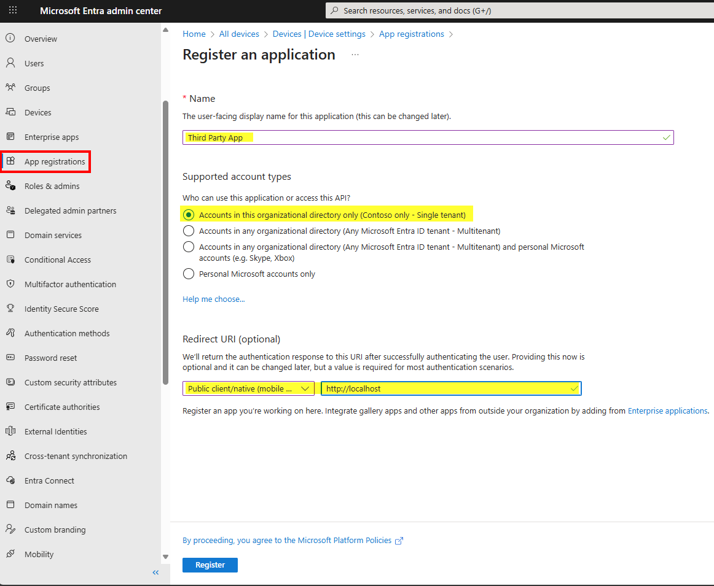
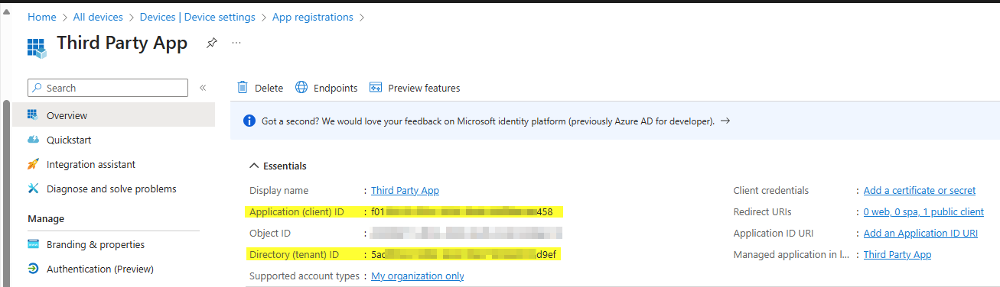
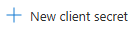
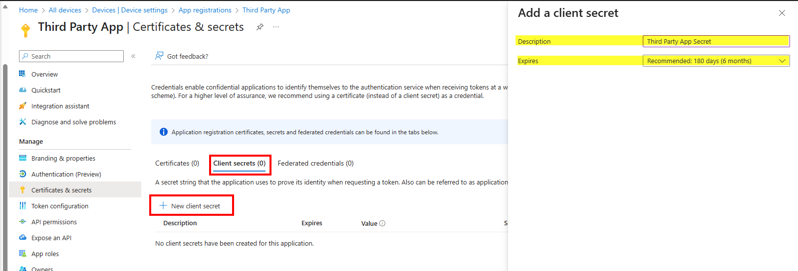
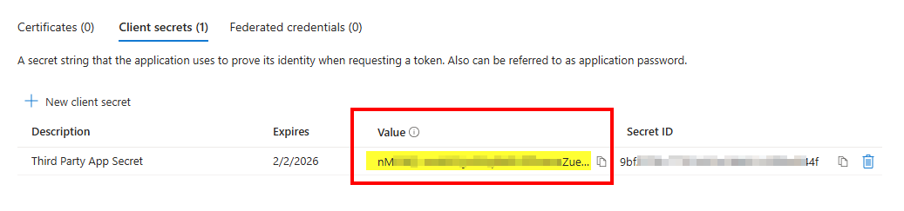
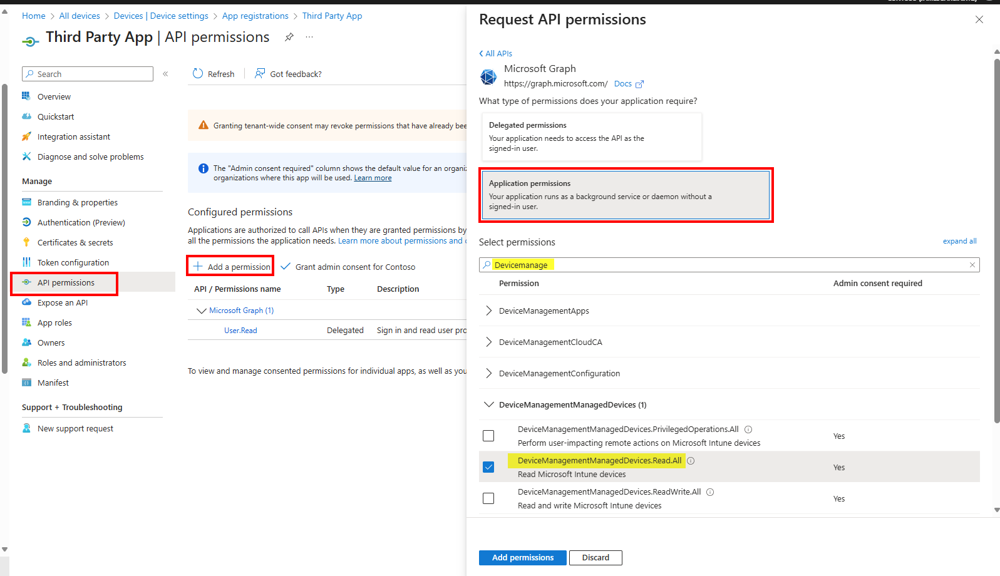
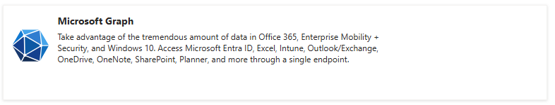
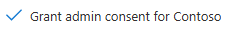
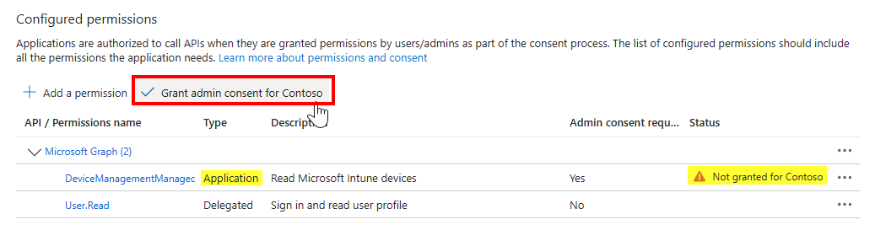

1. Create an App in the Entra. Go to Entra, and click on App registration. Click  Then fill in/select the following information. Then click Register.

   

2. This will create the app and provide the Client ID and Tenant ID that will be used later.
   
   

3. Click on Certificates & secrets for this app. Here you will create a Client secret. If not already selected click Client secrets (0). Then . This will open a blade to provide the secret name and how many days before it expires. Then click Add
   
   

4. You will presented with a client secret. The text under the Value column is the actual client secret. You will want to immediately copy that value and store it someplace safe to be used later because this value is only shown once. When you navigate from the page the key/value will be hidden. If in the case the value is hidden or expires you can create a new one and update the script with the new secret
   
   

5. Next click on API permissions tab. Click  Next click Microsoft Graph. (See second image below). Then click Application permission. Search on the permissions you need for the graph API. Then select the permissions and click Add permissions.
   
   

   

6. You will notice that the permissions status shows "Not granted for Contoso". To grant the permissions click on . Then click Yes to consent. Note: confirm that Type shows Application since this is for userless authentication method. That concludes the app registration and setup.

   

7. Next we will test in the Third-Party Graph Simulator. What you need to perform the next step are:
   1) Client ID (a.k.a. Application ID)
   2) Tenant ID 
   3) Client secret